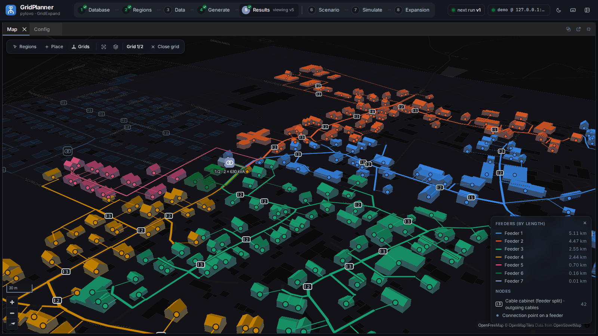

.. image:: docs/source/images/logo.png
    :width: 500
    :alt: pylovo logo

**Synthetic low-voltage distribution grids from open data.**

|badge_license| |badge_documentation|

`Documentation <https://pylovo.readthedocs.io/en/latest/>`_ · `Quickstart <https://pylovo.readthedocs.io/en/latest/getting_started/quickstart.html>`_

pylovo (PYthon tool for LOw-VOltage distribution grid generation) generates synthetic
low-voltage (LV) distribution grids for German postcode areas. It places transformers, routes
radial feeders along the streets, connects every supplied building with a service cable, sizes
all equipment with coincidence factors and voltage-drop limits, and checks every grid with a
power flow. The grids are stored as `pandapower <https://www.pandapower.org/>`_ networks and as
GIS tables in PostgreSQL/PostGIS.

    A generated grid in the GridPlanner browser UI: cables and 3D buildings coloured by feeder
    (demo region 85653 from OpenStreetMap data with synthetic LoD2 models).

Key features
------------

* **Open data** -- LoD2 buildings, Zensus 2022 households, basemap streets and postcode polygons
  from the `InfDB <https://github.com/tum-ens/InfDB>`_ (or from files); transformer positions from
  OpenStreetMap, LoD2 station buildings, DSO lists or manual edits.
* **Brownfield and greenfield grids** -- existing transformers as grid roots, load- and
  distance-constrained clustering and transformer placement for the rest.
* **Electrical dimensioning** -- category-specific coincidence, uniform feeder sections, feeder
  and service voltage-drop limits, power-flow check with stored diagnostics.
* **Reproducible versions** -- every run belongs to a ``VERSION_ID`` whose parameters are frozen in
  the database.
* **From one postcode to many** -- regions by postcode (PLZ) or municipality (AGS), parallel runs.
* **Analysis and visualisation** -- key figures per postcode and grid, QGIS templates, CSV and
  pandapower JSON export, plotting helpers, and the GridPlanner browser UI on top of an HTTP API.

The shipped data cover Bavaria; other regions need the corresponding InfDB data and transformer
download.

Quick start
-----------

Requirements: Linux or WSL2, Python 3.12, `uv <https://docs.astral.sh/uv/>`_, GDAL (``ogr2ogr``)
and a PostgreSQL database with PostGIS and pgRouting -- in the recommended setup the InfDB database
with processed buildings and streets (see the
`InfDB documentation <https://tum-ens.github.io/InfDB/usage/>`_).

.. code-block:: bash

   git clone https://github.com/tum-ens/pylovo.git
   cd pylovo
   uv sync                                   # add --extra plots for the plotting helpers
   cp .env.example .env                      # enter the database connection

Set up the schema ``pylovo`` and generate grids (run the commands from the repository root):

.. code-block:: bash

   uv run pylovo-setup                       # creates or migrates the schema without deleting grids
   uv run pylovo-generate --plz 80803        # one postcode
   uv run pylovo-generate --ags 09162000     # all postcodes of a municipality
   uv run pylovo-analyze --plz 80803 --all   # key figures

``pylovo-setup reset --database NAME`` explicitly deletes all PyLovo results; normal setup migrates in place. The
grid parameters are in ``config/config_generation.yaml``; use a new ``VERSION_ID`` when you change
them. All commands and options are described in the
`command-line reference <https://pylovo.readthedocs.io/en/latest/user_guide/cli.html>`_.

Browser UI (GridPlanner)
------------------------

GridPlanner is the browser UI for pylovo: database setup, region selection, transformer editing
and imports, configuration, generation jobs with live logs, statistics, a grid inspector with
diagnostics and an on-demand power flow, 3D buildings and load editing. It lives in its own
repository and runs pylovo as a container image with the HTTP API below; GridExpand can add grid
expansion steps on the same grids. See the
`browser UI guide <https://pylovo.readthedocs.io/en/latest/user_guide/browser_ui.html>`_.

.. code-block:: bash

   ./gridplanner init --without-gridexpand   # in a GridPlanner checkout: asks for the database
   ./gridplanner up                          # http://127.0.0.1:18780/

HTTP API
--------

``pylovo-api`` offers the same steps as a headless HTTP API: database setup, region selection,
transformer editing and imports, configuration, generation jobs with live logs, statistics, grid
details, diagnostics and an on-demand power flow. GridPlanner uses it; ``api/README.md`` lists the
endpoints.

.. code-block:: bash

   uv sync --extra api
   uv run --extra api pylovo-api             # http://127.0.0.1:8765/api/health

Scientific background
---------------------

The methodology is described in `Reveron Baecker et al. (2025): Generation of low-voltage synthetic
grid data for energy system modeling with the pylovo tool
<https://doi.org/10.1016/j.segan.2024.101617>`_.

License
-------

| The code of this repository is licensed under the **MIT License** (MIT).
| See `LICENSE.txt <LICENSE.txt>`_ for rights and obligations.
| Copyright: `pylovo <https://github.com/tum-ens/pylovo/>`_ © TUM ENS | `MIT <LICENSE.txt>`_

Citation
--------

| If you use this code in a scientific publication, please cite the following publication:
| * Reveron Baecker et al. (2025): `Generation of low-voltage synthetic grid data for energy system modeling with the pylovo tool <https://doi.org/10.1016/j.segan.2024.101617>`_

.. |badge_license| image:: https://img.shields.io/github/license/tum-ens/pylovo
    :target: LICENSE.txt
    :alt: License

.. |badge_documentation| image:: https://readthedocs.org/projects/pylovo/badge/?version=latest
    :target: https://pylovo.readthedocs.io/en/latest/
    :alt: Documentation
