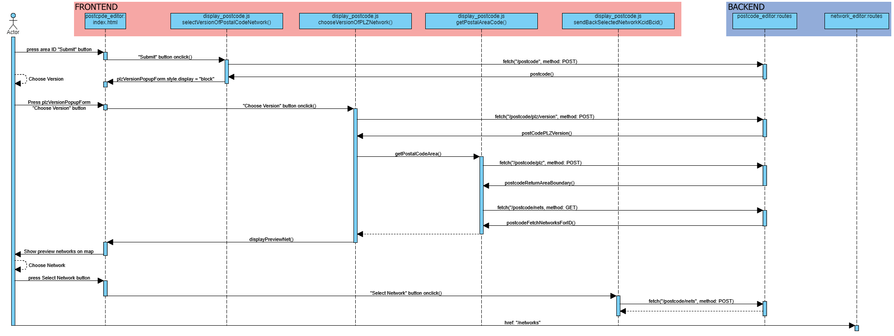
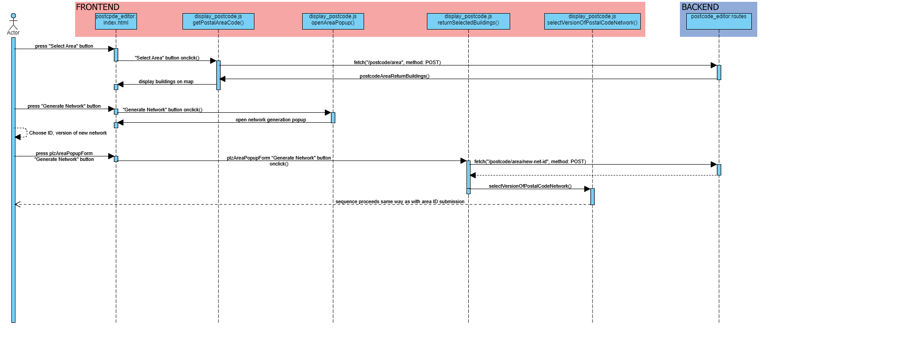

Development
###########

Tool execution flow
********************

Postcode editor
---------------
There are two ways program execution can go in the postcode editor window. Either the user decides to request information about already 
existing networks via a numerical ID or they draw a shape on the map to generate a new grid of networks.

Area selection via ID
======================

Area selection via shape
---------------------

If the user decides to create a new grid via area selection, the sequence will continue the same way as with network selection via ID once the user
has decided to generate the new networks.

Network editor
======================

Setup
------

Usage
------

Urbs setup editor
======================

Setup
------

Usage
-----

Returning urbs setup data
^^^^^^^^^^^^^^^^^^^^^^^^^^

Urbs result editor
======================