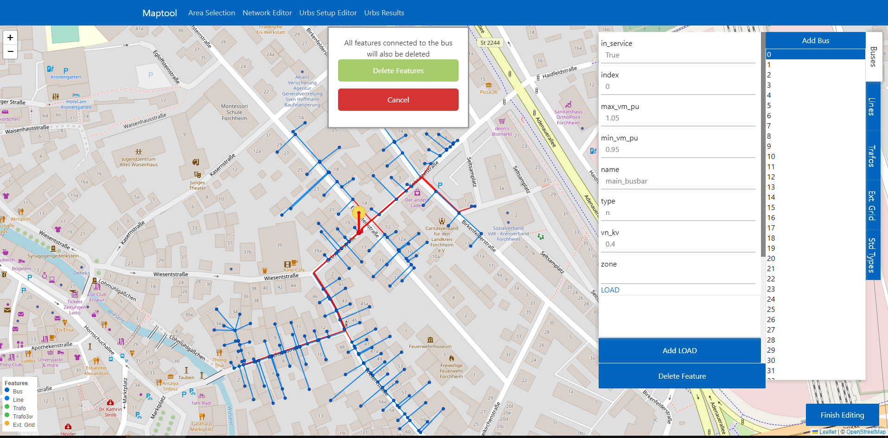

Network Editor
***************

In the network editor view the user can fine-tune individual features and extend the network by adding or removing new features, before handing over the network for
setup of the urbs run.

Features
========

Bus
---
| The nodes of the network graph. The synthetic grids generated by pylovo distinguish between connection node buses and consumer node buses. 
  Any bus that has a load attached is considered a consumer bus.

Line
-----
| The paths of the network graph. Each line is connected to two buses. 

Trafo
-----
| A transformer for connecting higher and lower voltage levels. The high voltage bus the trafo is attached to is also the bus the external grid is connected to. 

Ext_grid
--------
| The connection point of an external electrical grid to the local editable grid. There can only be one ext_grid for each network. 

Std_type
--------

| Std_types refer to the types of cables and transformators we can define our lines and trafo as. Changes to a std_type are applied to all features 
  that have this std_type assigned to them.

Editing features
=================
| The user can select a feature either by clicking on it on the map or by selecting the feature type from the button column on the left side of the screen and then choosing
  the feature they want to edit from the newly appeared list. 

Editing std_type features
-------------------------
| Std_types are assigned to lines and trafos. Since they have to be consistent for all lines/trafos their properties can only be adjusted in the std_type editor accessible
  over the left-side button column. Std_type properties are still listed in the line & trafo editors, but cannot be changed. Instead you select which std_type you want to 
  assign to each trafo & line individually.

Adding features
===============

| Every feature type list has an "Add [Feature]" button at the top. Clicking this button changes the map settings to draw mode. You can exit draw mode at any time
  by pressing **esc**

Adding buses
-------------
| Buses can be added anywhere on the map without restrictions. Simply click on the map where you want the bus to appear. The corresponding editor window will
  automatically be opened.
| IMPORTANT NOTE: The tool makes no assumptions about where a bus is placed. It is up to the user to ensure the placement makes logical sense in the context of the 
  current network.

Adding lines
------------
| Lines need to connect to two different buses to be viable. The user needs to start drawing by clicking on a bus, otherwise the tool will immediately exit draw mode.
  After starting from a bus, the user can draw as many intermediate points as they want. To finish creating the line the user needs to double click on a bus again.
| IMPORTANT  NOTE: Using urbs requires there be no circular line connections in the network. At the moment the tool does not check that this is the case. It is up to the user
  to make sure newly created lines do not create circles in the network graph.

Adding trafos
-------------
| Adding a trafo works the same way as adding a line. However, the network only allows for one trafo at a time. As long as a trafo exists, 
  the "Add Trafo" button will be unavailable.

Adding external grids
---------------------
| Adding external grids works much in the same way as adding buses, with the difference that external grids need to be placed on an already existing bus.
  Once the user has entered draw mode, they can create a new grid by double clicking on a bus on the map.
| Similarly to the trafo, we only allow one external grid at a time. While an ext_grid exists, the Add button will be disabled.

Adding secondary features
=========================
| Only buses have secondary features.
| While all of them can be added by clicking the corresponding button in the bus editor window, only loads are relevant for the actual usage of the tool
  as of right now.
| We determine whether a bus will be interpreted as a node to which we can attach processes in the urbs setup step, by the fact that they have at least
  one load attached to them.

Deleting features
=================

| All network features can be deleted by clicking on the "Delete Feature" button in the editor window. 
| For lines, trafos and ext_grids, clicking this button will instantly delete the feature. Since buses are referenced by other 
  features, said features will also be deleted, if you choose to remove a bus. The affected features will be highlighted red on the map 
  and the user will be prompted on whether they want to actually go ahead with the deletion.