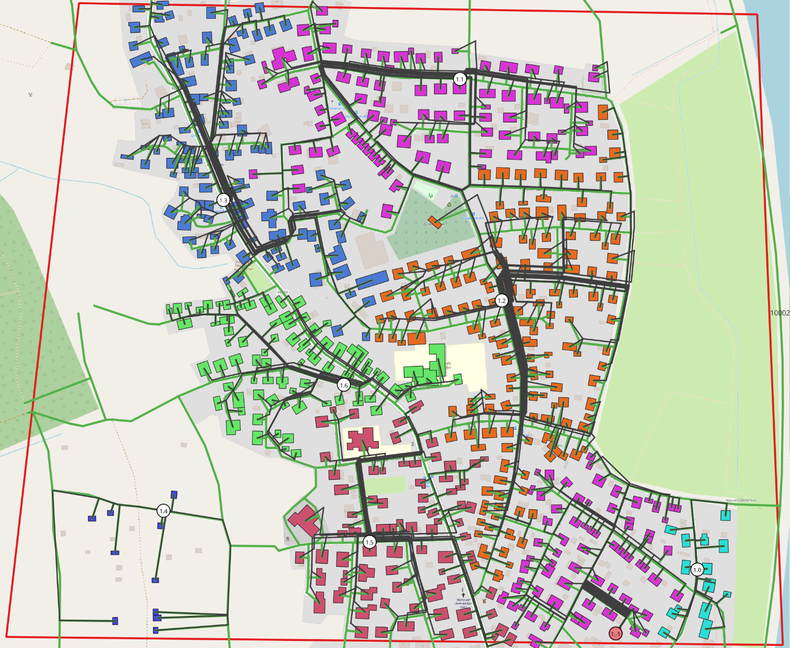

.. pylovo gui documentation master file, created by sphinx-quickstart on Wed Jul 12 12:49:48 2023

Introduction
******************************************************************
Overview pylovo (PYthon tool for LOw-VOltage distribution grid generation)
===========================================================
This tool provides a comprehensive public-data-based module to generate synthetic low-voltage distribution grids for a
freely-selected research area. The main data input is the buildings, roads and transformers geographic data that are obtained
from OpenStreetMap, with additional auxiliary datasets including postal code area polygons (to identify and select
research areas), consumer categories (to estimate loading performances of different types of buildings and households)
and infrastructure parameters, etc. The result outputs a feasible solution of aggregated distribution grid networks
within the research scope and can automatically analyse the important grid statistics to enable the user to evaluate the
general grid properties for the generated synthetic grids.

At the current state of the project the data is prepared for Bavaria, but will be extended to Germany.
Due to the large amount of data, external users need to setup a local PosgreSQL database for the grid generation process.
A step by step tutorial to understand the product of this tool can be found in the notebook_tutorials directory.

.. note::

    | **Citation**: In case you use pylovo in a scientific publication, we kindly request you to cite our publication listed in the :doc:`further_reading` section.
    | **Collaboration**: pylovo is open-source available on GitHub and open for collaboration.

Contents
===========================================================
In this documentation you can find instructions and information on:

* How to install pylovo in :doc:`installation/installation`.
* How to generate grids in :doc:`grid_generation/index`.

* How the grids are generated in :doc:`grid_generation/explanation/grid_generation_process`.
* How to create grid classes and representative grids in :doc:`classification/index`.
* How to visualise your results in :doc:`visualisation/index`.

Legal Notice
==========================
`MIT License <https://opensource.org/license/MIT>`_ , Copyright (C) 2023-2025 Beneharo Reveron Baecker

Acknowledgement
==========================
The development of this software has been supported by contributions of the following persons: Soner Candas, Deniz Tepe,
Tong Ye, Daniel Baur, Julian Zimmer and Berkay Olgun.

Structure
===========================================================

.. toctree::
    :maxdepth: 2

    self
    installation/installation
    grid_generation/index
    classification/index
    visualisation/index
    further_reading
    docs_sphinx/index