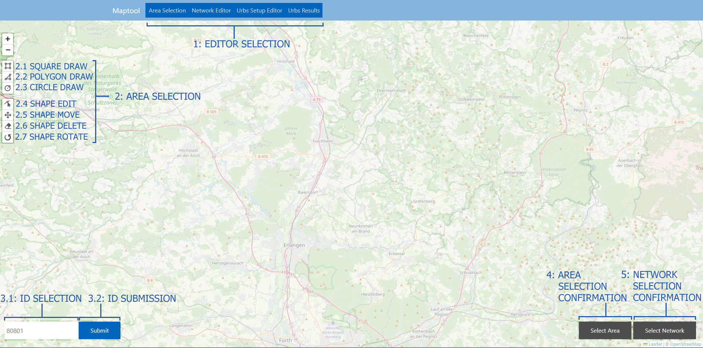
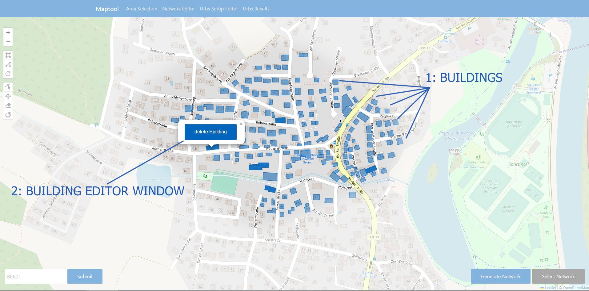

Area Selection
***************

This is the page that will open by default by navigating to `http://127.0.0.1:5000 <http://127.0.0.1:5000>`_.
Here the user can either draw shapes directly on the map to delineate areas in which new networks should be generated or ask the database
for previously generated networks by submitting an ID.

Visual overview
===============

Network generation by area
==========================

Area selection
---------------
| The user can draw shapes directly on the map using the toolbar in the upper left corner of the screen. 
  Buttons 2.1-2.3 in the visual overview allow the creation of different basic shape types, 
  while buttons 2.4-2.7 allow editing already created shapes.
| Once a shape has been drawn, the **Select Area** button (4) will be enabled.

| **Important note**: Only a single shape is allowed at any given time. Finishing drawing a new shape will delete any previously drawn shapes.

Building selection & network generation
----------------------------------------

| Once the user presses the **Select Area** button, all buildings within the selected area will be displayed on the map. The user can now delete
  individual buildings by clicking on them and then clicking the **delete Building** button in the popup window.
| Once the user is happy with their selection of buildings, they can generate a network based on their selection by pressing the **Generate Network** button.

Network generation & selection by ID
====================================

[IMAGE HERE FOR VERSION SELECTION][IMAGE HERE FOR NETWORK SELECTION]

| If a user instead wants to work on a previously generated network, they can do so by supplying the associated ID code.
  After entering it into the ID selection field (3.1) and pressing the **Submit** button (3.2), the tool will ask the user to select an available
  version of the networks and display all networks for a given ID and version on the map.
  The user can select a network either by clicking on it or selecting it from the list on the right side of the window.
  Finally, they can confirm their selection by pressing the **Select Network** button on the bottom right.